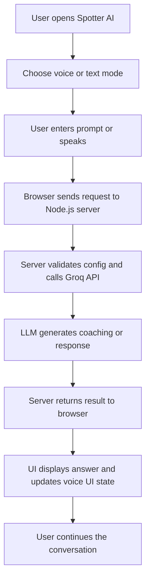
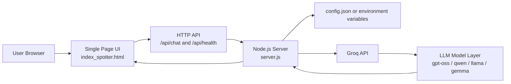
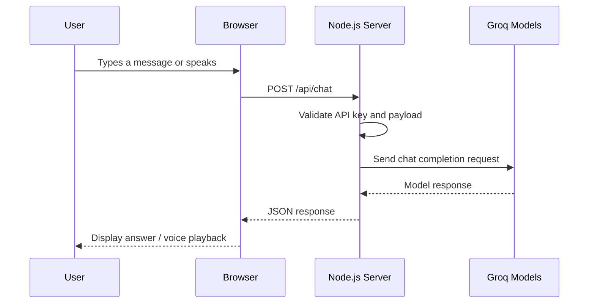
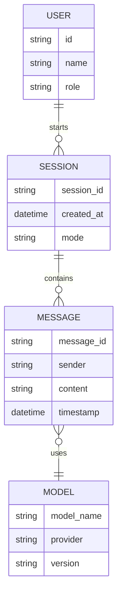

# Spotter AI

Spotter AI is a lightweight, real-time AI coaching assistant designed to help users practice conversations, improve communication quality, and receive instant feedback through voice and text interactions. The project combines an interactive front-end experience with a secure Node.js API proxy that routes requests to Groq-hosted large language models.

This project is positioned as a practical AI product for users who want a fast, private, low-friction coaching experience without needing a complex backend or heavy database infrastructure at MVP stage.

## 1. Executive Summary

Spotter AI solves a common problem: people want intelligent, on-demand coaching for communication but do not have access to a persistent, personalized, low-friction system they can use anytime.

The current product enables:
- live AI conversation in text mode
- voice-based interaction using browser speech APIs
- a real-time coaching experience with an animated, conversational interface
- secure LLM access through a backend proxy instead of exposing the API key in the browser

At a higher level, this product is a foundation for future use cases such as:
- interview preparation
- public speaking practice
- leadership communication coaching
- sales conversation rehearsal
- daily confidence and communication training

## 2. Product Problem Statement

### Real-world problem
Many users struggle with communication improvement because coaching is expensive, inconsistent, or unavailable in the moment. Traditional solutions usually require:
- a human coach or mentor
- scheduled sessions
- high costs
- limited practice frequency
- lack of personalized, always-available feedback

For students, job seekers, founders, and professionals, communication is often the difference between opportunity and missed opportunity. Yet most users do not have a convenient way to practice repeatedly in realistic scenarios.

### Why the problem matters
Confidence, clarity, and preparation directly affect outcomes in:
- interviews
- startup pitches
- team meetings
- sales conversations
- customer interactions
- networking

The cost of poor communication is often much higher than the cost of building a smart practice tool.

## 3. Product Vision

Spotter AI aims to become a personal AI communication coach that is:
- always available
- fast and conversational
- accessible via voice and text
- personalized over time
- useful for daily practice and confidence building

The MVP is intentionally focused on speed, accessibility, and simplicity. It is not a massive enterprise platform yet; instead, it is a strong proof of concept for a future AI-native coaching product.

## 4. Core User Needs

### Primary users
- job seekers preparing for interviews
- students practicing presentations or spoken responses
- startup founders practicing pitch storytelling
- professionals improving workplace communication
- people who want easier, low-pressure daily confidence coaching

### User pain points
- no immediate access to feedback
- weak self-practice without accountability
- difficult to rehearse with no realistic conversation partner
- expensive coaching services
- inconsistent preparation quality

### Product value
Spotter AI gives users a responsive AI conversation partner that feels immediate, low-stakes, and practical. It reduces friction in the path from “I want to practice” to “I am practicing right now.”

## 5. Product Scope and MVP

### Included in this version
- single-page chat interface
- voice-enabled interaction using browser speech recognition
- backend LLM proxy for secure API routing
- Groq model fallback support
- health check endpoint
- local deployment support for easy development and testing

### Out of scope for MVP
- persistent user accounts
- chat history database
- authentication and authorization
- analytics dashboard
- premium subscription management
- multi-user collaboration
- advanced speech-to-speech personalization

## 6. Problem-to-Solution Mapping

| Problem | User friction | Spotter AI solution |
| --- | --- | --- |
| Lack of practice time | Users do not practice often enough | Quick AI conversation available anytime |
| High coaching cost | Human coaching is expensive | Uses affordable LLM APIs for instant feedback |
| Fear of judgment | Users avoid public practice | AI acts as a safe and always-available partner |
| Inconsistent preparation | No structured guidance | Offers guided conversational flows |
| Limited access to feedback | People cannot get instant coaching | Enables live, real-time assistant responses |

## 7. Product Experience Flow

This product is designed to feel simple: the user opens the app, speaks or types a prompt, and receives a useful response in a conversational format.



## 8. System Architecture

The current architecture is intentionally minimal and production-ready for an MVP. It separates the user interface from the model access layer and keeps sensitive credentials on the server side.



### Architectural notes
- The browser never directly calls the external model provider.
- API keys remain server-side, reducing leakage risk.
- The app relies on local deployment while keeping the stack simple.
- Model fallback logic improves reliability when one model is unavailable.

## 9. Sequence Diagram



## 10. Data Model and Logical Structure

This MVP does not currently use a database, but conceptually the product can be represented as a lightweight conversational data model.



### Data handling in current version
- User input is handled transiently in-browser
- A backend request is sent for AI processing
- The model response is returned immediately
- No permanent chat database is required for MVP

## 11. Technical Stack

| Layer | Technology | Purpose |
| --- | --- | --- |
| Runtime | Node.js | Application runtime |
| Backend | Native HTTP server in Node.js | Lightweight API layer |
| Frontend | HTML, CSS, JavaScript | Chat and voice user interface |
| Voice | Web Speech API | Browser-based speech recognition and playback |
| AI Provider | Groq | Fast inference for chat completions |
| Configuration | JSON config + environment variables | Secure secret management |
| Deployment | Local Node server | Simple MVP deployment |

## 12. Current Product Features

### Text-based coaching
Users can type prompts and receive AI-generated feedback in real time.

### Voice-based interaction
The interface supports speech recognition and can simulate an interactive conversational experience with an animated orb.

### Model fallback system
The backend tries a series of Groq models to improve availability and resilience.

### Security-conscious server design
The API key is kept on the server side instead of exposing it in browser-side code.

## 13. Product Roadmap

### Phase 1: MVP launch
- stable voice + text chat
- Groq API integration
- health check endpoint
- local deployment
- polished front-end experience

### Phase 2: Personalization
- session history
- user preferences
- conversation memory
- feedback quality scoring

### Phase 3: Structured coaching flows
- mock interview mode
- pitch practice mode
- speaking scorecards
- role-based coaching experiences

### Phase 4: Scale and productization
- authentication
- dashboard analytics
- subscription model
- user accounts and saved progress
- multi-modal coaching experiences

## 14. Business and Strategic Value

Spotter AI is attractive as an AI product because it combines three important dimensions:
- practical user need
- low implementation complexity
- clear future expansion path

It is especially valuable for founders and product teams seeking a real-world AI demo that maps to a meaningful user problem with strong usability and growth potential.

## 15. Risks and Considerations

### Technical risks
- model availability or rate limits from LLM providers
- browser speech API variability across devices
- internet dependency for real-time AI responses

### Product risks
- generic AI output without strong user context
- weak differentiation without a clear coaching persona
- poor UX if voice flow is not smooth and responsive

### Mitigation strategies
- use model fallback logic
- maintain a clean and responsive UI
- structure prompts around practical coaching patterns
- add personalization in later stages

## 16. Why This Project Is Strong

This project shows a good product foundation because it is:
- user-centric
- technically lightweight
- quick to demo
- scalable into a serious AI coaching platform
- easy to understand for product stakeholders and developers

It demonstrates that a valuable AI product does not always require a massive stack at the beginning; it requires clear user value, thoughtful interaction design, and a strong technical execution path.

## 17. Getting Started

### 1. Install Node.js
Download from [nodejs.org](https://nodejs.org) and use a recent version.

### 2. Configure the API key
Copy `config.json.example` to `config.json` and add your Groq key:

```json
{
  "GROQ_API_KEY": "gsk_YOUR_KEY_HERE"
}
```

You can also set the key as an environment variable:

```bash
export GROQ_API_KEY="gsk_YOUR_KEY_HERE"
```

### 3. Start the application

```bash
node server.js
```

### 4. Open the app
Visit:

```text
http://localhost:3000
```

## 18. Project Structure

```text
spotter-deploy/
├── server.js
├── index_spotter.html
├── config.json.example
├── config.json
├── package.json
├── README.md
└── .gitignore
```

## 19. License

This project is currently intended for local development, rapid prototyping, and product exploration. Please review and confirm the license strategy before commercial deployment.

## 20. Summary

Spotter AI is a focused, practical AI communication coach with a strong MVP foundation. It addresses a real pain point in a way that is simple, testable, and scalable. The project is an excellent example of turning a meaningful user problem into a usable AI product with minimal friction.

The combination of a clean web experience, secure backend model access, and a realistic product story makes Spotter AI a strong candidate for demo, iteration, and future growth.

